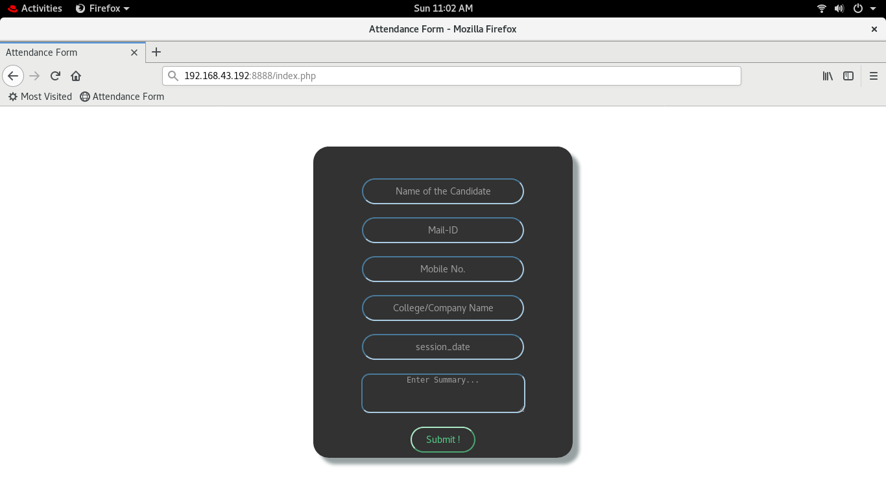
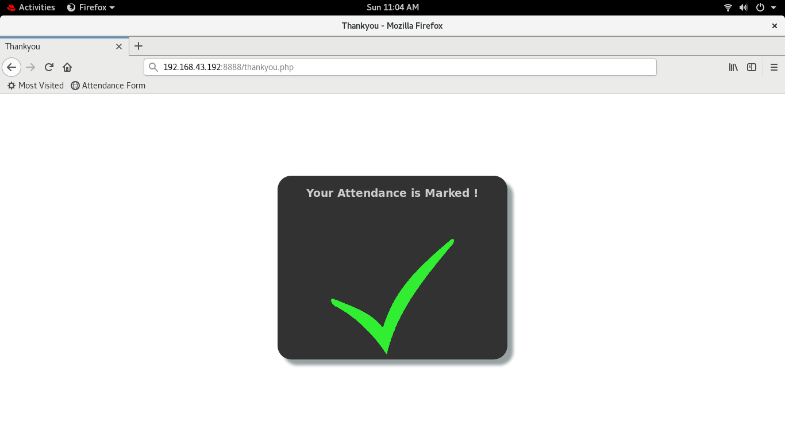

# Online-Lecture-Attendance-Website
Hey, This project is created using a docker with the help of python3 and mysql. This project help you for online Attendance Management by using h website. one single click and launch a complete website with mysql database. Website is use to maintain and manage the attendance of students/employees.

# Requirements to Run this project:
--> You should have installed Redhat linux OS with python3.
--> You should have yum with configure.

# How to run this Project:
1. First you have to download DockerPy folder.
2. change your dir to DockerPy.
3. Then run main.py file using python3     
    Like:
     > python3 main.py

# launched Website:
You should be able to access the site with the IP of your host in the windows browser.
Run the following command in any browser:

     > (IP of your host system):8888/index.php               {for ex:172.16.0.2:8888/index.php}

# Official link for reference                                                                          
  Here are some official links for your reference about docker:
  https://www.docker.com/
